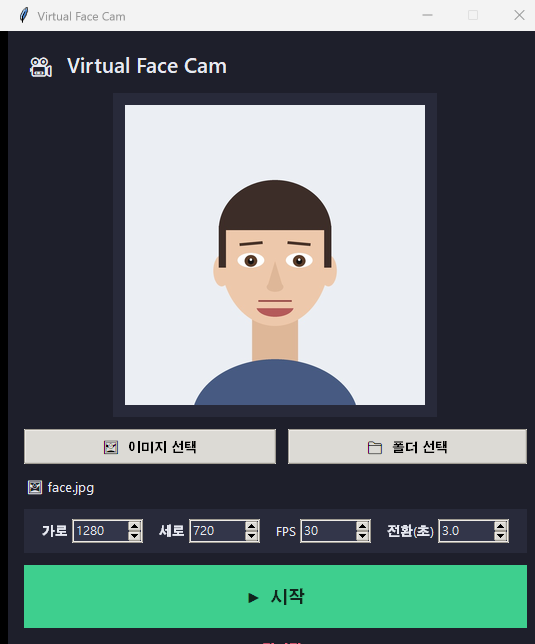
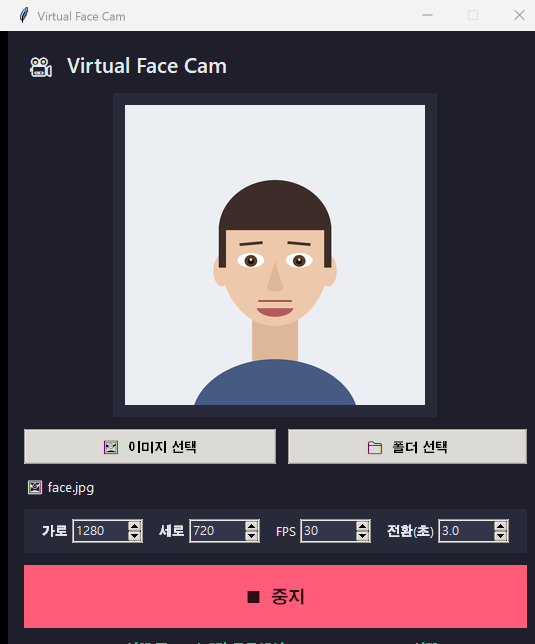

# virtual-face-cam

정적 이미지(또는 이미지 폴더)를 **가상 웹캠**으로 출력하는 작은 도구입니다.
Zoom, Teams, 브라우저, 얼굴 인식 프로그램 등에서 실제 웹캠처럼 선택해 사용할 수 있습니다.

Windows · macOS · Linux 지원 ([pyvirtualcam](https://github.com/letmaik/pyvirtualcam) 기반).
macOS에서는 Tkinter 없는 브라우저 UI 앱도 `mac/` 폴더에 포함되어 있습니다.

| 대기 화면 | 실행 중 |
|-----------|---------|
|  |  |

## ⚠️ 사용 범위

이 도구는 **얼굴 인식/검출 소프트웨어 개발·테스트**, 화상회의용 정적 화면,
데모 등 **정당한 용도**를 위한 것입니다.
타인의 신원 인증(KYC, 화상 시험 감독, 얼굴 로그인 등)을 우회하는 데 사용하지 마세요.
법적 책임은 사용자에게 있습니다.

## 1. 가상카메라 드라이버 설치

| OS | 방법 |
|----|------|
| **Windows** | [OBS Studio](https://obsproject.com/) 설치 후 1회 실행 (가상카메라 드라이버 포함) |
| **macOS** | [OBS Studio](https://obsproject.com/) 설치 후 1회 실행. 최초 실행 시 "가상 카메라 시작"을 눌러 시스템 확장 승인 |
| **Linux** | `v4l2loopback` 설치 — 예: `sudo apt install v4l2loopback-dkms` 후 `sudo modprobe v4l2loopback` |

드라이버 설치 후 OBS를 계속 켜둘 필요는 없습니다.

## 2. 설치 (넷 중 택1)

> ⚠️ 어떤 방식이든 **1번의 가상카메라 드라이버 설치는 필수**입니다.
> 드라이버는 OS에 등록되는 시스템 요소라 실행 파일에 포함할 수 없습니다.
> Python으로 실행하는 경우 **Python 3.10 이상**이 필요합니다.

### A. macOS 앱 — Mac 권장

macOS에서는 Tkinter 없이 동작하는 브라우저 UI 앱을 권장합니다.

```bash
cd mac
./run-mac.command
```

또는 Finder에서 `mac/Virtual Face Cam.app`을 더블클릭하세요.
처음 실행하면 `~/Library/Application Support/VirtualFaceCamMac/.venv`에
필요한 Python 패키지를 설치하고 로컬 브라우저 UI를 엽니다.

### B. pipx — 한 줄 설치 (Mac/Win/Linux 공통)

`npm install -g`와 가장 비슷한 방식입니다. 설치하면 `virtual-face-cam` 명령이 생깁니다.

```bash
pipx install git+https://github.com/TaeHuiKKIM/virtual-face-cam.git
# 또는 저장소를 받은 뒤
pipx install .

virtual-face-cam face.jpg
```

pipx가 없으면: `pip install pipx` 후 `pipx ensurepath`.

### C. 실행 파일(.exe / .app) — Python 없는 팀원용

Python이 없는 팀원에게는 미리 빌드한 실행 파일 하나만 전달하면 됩니다.
빌드하는 사람은 **배포 대상 OS에서** 다음을 실행하세요 (PyInstaller는 크로스 컴파일 불가):

```bash
pip install -r requirements.txt pyinstaller
python build.py
# Windows -> dist/virtual-face-cam.exe
# macOS   -> dist/virtual-face-cam
```

### D. 직접 실행 (개발용)

```bash
pip install -r requirements.txt
python virtual_cam.py face.jpg
```

의존성은 `pyvirtualcam`, `numpy`, `pillow`만 사용합니다. 이전 버전에서 쓰던
OpenCV 의존성은 macOS 설치 실패 가능성을 줄이기 위해 제거했습니다.

## 3. 실행

### macOS 앱 — 추천

```bash
cd mac
./run-mac.command
```

이미지/폴더를 업로드하고 **Start**를 누르면 가상 카메라가 켜집니다.
다른 앱의 카메라 목록에서 `OBS Virtual Camera`를 선택하세요.
상세 내용은 [mac/README.md](mac/README.md)를 참고하세요.

### Tkinter GUI

```bash
python gui.py
# 또는 pipx 설치 후: virtual-face-cam-gui
```

이미지/폴더를 선택하고 **시작** 버튼을 누르면 가상 카메라가 켜지고,
**중지**를 누르면 꺼집니다. 해상도·FPS·전환 간격도 창에서 조절할 수 있습니다.

macOS에서 Homebrew Python을 쓰는 경우 `tkinter`가 별도 패키지라 GUI 실행이
실패할 수 있습니다. 이때는 현재 Python 버전에 맞춰 설치하세요:

```bash
brew install python-tk@3.14   # 예: python3 --version 이 3.14.x인 경우
brew install python-tk@3.13   # 예: python3 --version 이 3.13.x인 경우
```

기존 더블클릭용 `실행_Mac.command`는 Python 3.10 이상과 Tkinter를 확인한 뒤
`.venv-mac` 가상환경을 만들고 필요한 패키지만 설치합니다.

### CLI

```bash
# 이미지 한 장
python virtual_cam.py face.jpg

# 폴더 안의 이미지들을 순환 (기본 3초 간격)
python virtual_cam.py ./images --interval 5

# 해상도/프레임레이트 지정
python virtual_cam.py face.jpg --width 640 --height 480 --fps 30
```

실행하면 `OBS Virtual Camera`라는 카메라가 생기고, 다른 앱의 카메라 목록에서
선택하면 지정한 이미지가 계속 출력됩니다. 종료는 `Ctrl+C`.

### 옵션

| 옵션 | 기본값 | 설명 |
|------|--------|------|
| `--width` | 1280 | 출력 가로 해상도 |
| `--height` | 720 | 출력 세로 해상도 |
| `--fps` | 30 | 프레임레이트 |
| `--interval` | 3.0 | (폴더일 때) 이미지 전환 간격(초) |

## 4. 테스트용 얼굴 이미지 만들기

실제 사진이 없으면 간단한 일러스트 얼굴을 생성할 수 있습니다:

```bash
python make_face.py   # face.jpg 생성
```

> 참고: 일러스트는 단순 얼굴 검출에는 통과할 수 있으나, 딥러닝 기반
> 얼굴 **인식** 엔진은 사람으로 판단하지 못할 수 있습니다. 확실한 테스트에는
> 실제 사람 사진이나 AI 생성 얼굴 사진을 사용하세요.

## 문제 해결

- **가상 카메라를 시작할 수 없다** → 드라이버(OBS / v4l2loopback) 설치 여부 확인.
- **다른 앱에 카메라가 안 보인다** → 해당 앱을 완전히 종료 후 다시 실행.
- **macOS에서 권한 오류** → 시스템 설정 > 개인정보 보호 및 보안에서 OBS 가상 카메라 시스템 확장 허용.
- **macOS에서 `No module named '_tkinter'`** → `mac/` 폴더의 브라우저 UI 앱을 쓰거나, Homebrew Python 버전에 맞춰 `brew install python-tk@현재버전`을 설치하세요.

## 라이선스

MIT
