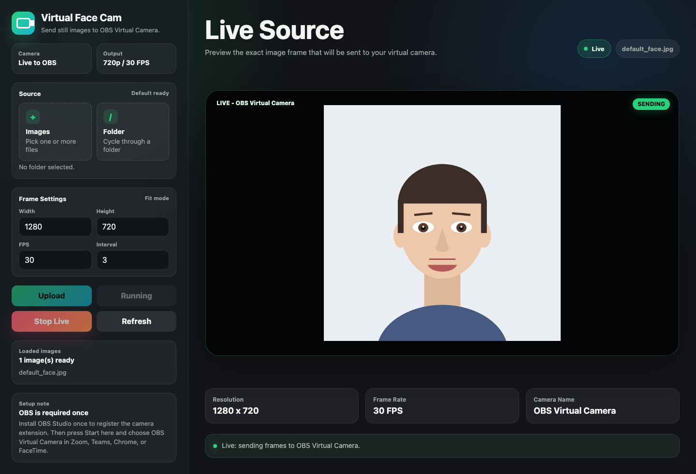

# Virtual Face Cam

이미지 한 장이나 이미지 폴더를 **가상 웹캠**으로 내보내는 앱입니다.
Zoom, Teams, Chrome 같은 앱에서 카메라를 고를 때 `OBS Virtual Camera`를 선택하면
내가 고른 이미지가 웹캠 화면처럼 보입니다.

## 실행 화면



## OBS 없이 Mac 앱 자체만으로 쓰고 싶다면

OBS Virtual Camera를 설치하지 않고 `Virtual Face Cam`이 macOS 카메라 목록에 직접
나오게 만드는 네이티브 Mac 버전은 아래 저장소를 보세요.

https://github.com/TaeHuiKKIM/virtual-face-cam-mac

이 방식은 Apple Developer Team, App Group, macOS System Extension 승인이 필요합니다.

## Mac에서 가장 쉬운 사용법

### 1. OBS Studio 설치

1. https://obsproject.com/ 에 들어갑니다.
2. macOS용 OBS Studio를 설치합니다.
3. OBS를 한 번 실행합니다.
4. OBS에서 **Start Virtual Camera**를 한 번 누릅니다.
5. macOS가 시스템 확장 허용을 물어보면 허용합니다.
6. 필요하다고 나오면 Mac을 재시동합니다.

OBS는 가상 카메라 드라이버를 등록하기 위해 필요합니다.
드라이버 등록 후에는 Virtual Face Cam을 쓸 때 OBS 창을 계속 켜둘 필요는 없습니다.
OBS 안의 **Start Virtual Camera**는 등록 확인용입니다. 실제 이미지 송출은 아래에서
Virtual Face Cam 앱의 **Start** 버튼으로 시작하세요.

### 2. 이 저장소 다운로드

1. 이 GitHub 페이지의 초록색 **Code** 버튼을 누릅니다.
2. **Download ZIP**을 누릅니다.
3. 받은 ZIP 파일을 압축 해제합니다.
4. 압축을 푼 폴더에서 `mac` 폴더를 엽니다.

### 3. 앱 실행

1. `Virtual Face Cam.app`을 오른쪽 클릭합니다.
2. **열기**를 누릅니다.
3. 경고창이 나오면 다시 **열기**를 누릅니다.
4. 브라우저 창이 열릴 때까지 기다립니다.

처음 실행할 때 필요한 Python 패키지를 자동으로 설치합니다. 네트워크 상태에 따라
조금 걸릴 수 있습니다.

터미널에서 실행하고 싶으면:

```bash
cd mac
./run-mac.command
```

### 4. 이미지 보내기

앱을 처음 열면 기본 이미지가 미리 준비되어 있습니다. 그대로 써도 되고, 원하는
이미지로 바꾸려면 아래 순서대로 진행하세요.

1. 브라우저 창에서 이미지 파일 또는 폴더를 선택합니다.
2. **Upload**를 누릅니다.
3. **Start**를 누릅니다.
4. Zoom, Teams, Chrome 같은 앱을 엽니다.
5. 카메라 선택에서 `OBS Virtual Camera`를 고릅니다.

종료하려면 브라우저 창에서 **Stop**을 누르거나 앱을 종료하세요.

## Windows에서 가장 쉬운 사용법

1. https://obsproject.com/ 에서 Windows용 OBS Studio를 설치합니다.
2. OBS를 한 번 실행해서 가상 카메라 기능을 준비합니다.
3. https://www.python.org/downloads/ 에서 Python을 설치합니다.
4. Python 설치 화면에서 **Add Python to PATH**를 꼭 체크합니다.
5. 이 저장소를 **Code > Download ZIP**으로 다운로드하고 압축 해제합니다.
6. `실행_Windows.bat`을 더블클릭합니다.
7. 이미지나 폴더를 선택하고 **시작**을 누릅니다.
8. 사용할 앱에서 `OBS Virtual Camera`를 선택합니다.

## Linux 사용법

Linux에서는 `v4l2loopback`이 필요합니다.

```bash
sudo apt install v4l2loopback-dkms
sudo modprobe v4l2loopback
python3 -m pip install -r requirements.txt
python3 virtual_cam.py face.jpg
```

## 자주 막히는 부분

### 카메라 목록에 안 보여요

1. OBS Studio를 설치했는지 확인합니다.
2. OBS에서 **Start Virtual Camera**를 한 번 눌렀는지 확인합니다.
3. Mac에서는 시스템 설정 > 일반 > 로그인 항목 및 확장 프로그램 > 카메라 확장에서 OBS Virtual Camera가 켜져 있는지 확인합니다.
4. Virtual Face Cam 앱에서 **Start**를 눌러 상태가 `Live`로 바뀌었는지 확인합니다.
5. Zoom, Teams, Chrome을 완전히 종료했다가 다시 켭니다.
6. 그래도 안 되면 Mac을 한 번 재시동합니다.

### Mac에서 앱이 안 열려요

처음 실행할 때는 더블클릭 대신 오른쪽 클릭 후 **열기**를 사용하세요.
macOS Gatekeeper 때문에 처음 한 번은 이 과정이 필요할 수 있습니다.

### Mac에서 Python 오류가 나요

`mac/Virtual Face Cam.app` 또는 `mac/run-mac.command`를 쓰는 것을 권장합니다.
기존 `실행_Mac.command`는 Tkinter가 필요해서 Homebrew Python 환경에서는
`No module named '_tkinter'` 오류가 날 수 있습니다.

## 개발자용 실행

Python 3.10 이상이 필요합니다.

```bash
python3 -m pip install -r requirements.txt
python3 virtual_cam.py assets/default_face.jpg
```

GUI:

```bash
python3 gui.py
```

macOS 브라우저 UI:

```bash
cd mac
./run-mac.command
```

## 옵션

```bash
python3 virtual_cam.py face.jpg --width 1280 --height 720 --fps 30
python3 virtual_cam.py ./images --interval 5
```

| 옵션 | 기본값 | 설명 |
|------|--------|------|
| `--width` | 1280 | 출력 가로 해상도 |
| `--height` | 720 | 출력 세로 해상도 |
| `--fps` | 30 | 프레임레이트 |
| `--interval` | 3.0 | 폴더를 쓸 때 이미지가 바뀌는 간격 |

## 주의

이 도구는 개발 테스트, 데모, 화상회의용 정적 화면 같은 정당한 용도를 위한 것입니다.
타인의 신원 인증, 화상 시험 감독, 얼굴 로그인 같은 절차를 우회하는 데 사용하지 마세요.

## 라이선스

MIT
